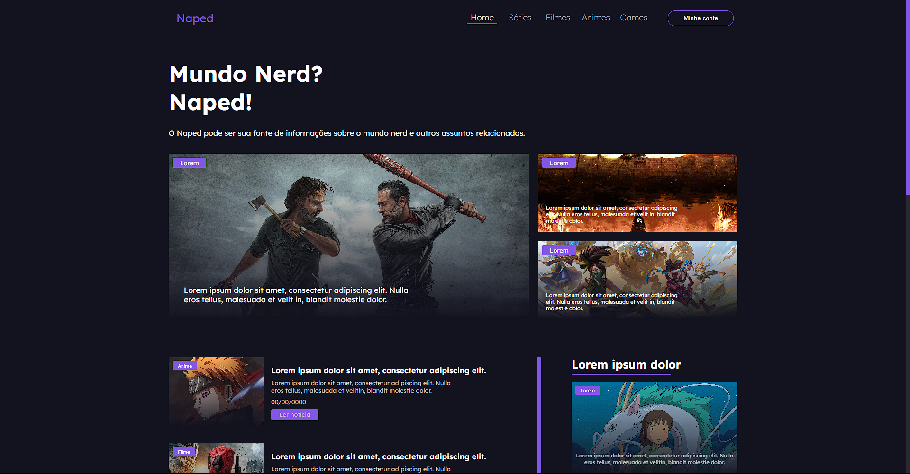

<h1 align="center">Naped</h1>
<p align="center">Landing Naped</p>


### ✒️ Sobre
Desenvolvimento de uma Landing Page de entretenimento, visando muito a responsividade e o uso de rotas deixando projeto com uma interatividade maior e uma beleza única. Aprimorada para uma experiência de usuário mais intuitiva e agradável.

<hr>
<h1 align="center">
  
</h1>

<p>Link: <a href="https://naped-nine.vercel.app/">Naped</a></p>

### 🛠 Tecnologias

As seguintes ferramentas foram usadas na construção do projeto:

- React
- TypeScript
- React-router-dom

### Pré-requisitos

Antes de começar, você vai precisar ter instalado em sua máquina as seguintes ferramentas:
[Git](https://git-scm.com). <br>
Além disto é bom ter um editor para trabalhar com o código como [VSCode](https://code.visualstudio.com/)

### 🎲 Rodando

```bash
# Clone este repositório
$ git clone <https://github.com/Gguife/planPurchase/new/main?readme=1>

# Instale as dependências
$ npm install

# Execute a aplicação em modo de desenvolvimento
$ npm run dev

# O servidor inciará na porta:5173
```
